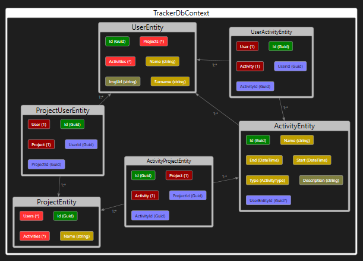
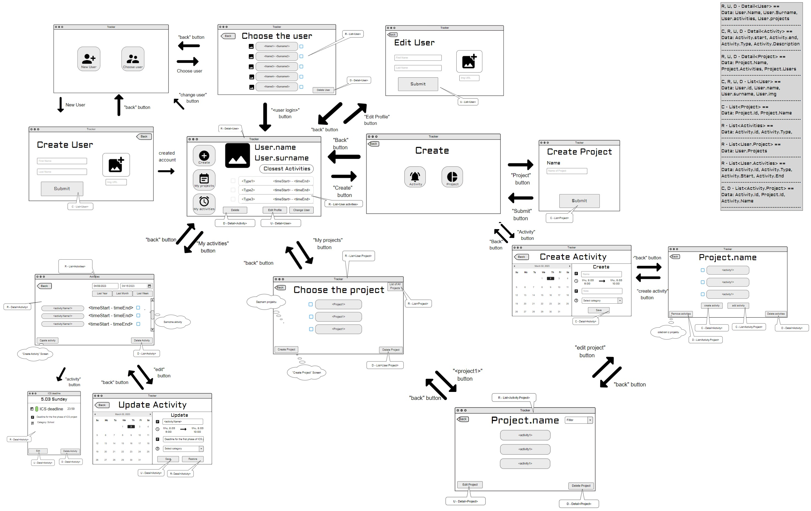

# Tracker

## ER Diagram

## Wireframe
[Odkaz](https://app.moqups.com/iVb6rlHYNq6hDliQ0AVvcVfNsY2NfBnI/view/page/ad64222d5 ) na použitý nástroj.

## Funkcionalita 1. fáze.
1. Logický návrh tříd ve formě výše uvedeného a vygenerovaného ER diagramu.
    * ER diagram vygenerován za pomocí Visual Studio IDE
    * Základní návrh datových modelů je uveden níže.
2. Využití abstrakce, zapouzdření, polymorfismu v oblasti databází.
3. Verzování v GITu po logických částech v podobě commitů na Azure.
    * Commity do Main branch jen za pomocí schválených pull requestů.
4. Wireframy (logickou strukturu, uživatelskou přívětivost, ne kvalitu grafického zpracování)
    * Wireframe je zobrazený výše v README s odkaz na použitý nástroj.
5. Využití Entity Framework Core - Code First přístupu na vytvoření databáze z entitních tříd.
    * Tento přístup je v projektu *Tracker.DAL/Migrations*.
6. Existence databázových migrací (alespoň InitialMigration).
    * Automaticky vygenerované migrace jsou v projektu *Tracker.DAL/Migrations*.

## Funkcionalita 2. fáze.
1. Opravení chyb a zapracování připomínek, které jsme dostali v rámci hodnocení fáze 1
2. Návrh a funkčnost repositářů
3. Návrh a funkčnost fasád
    * Activity fasády pro uživatela se dají zlinkovat přes UserId
    * K projektům uživatele se dostane přes includeNavigationPath
4. Pokrytí aplikace testy
    * Ukázali sme tím, že repositáře opravdu fungují
5. Zapouzdření databázových entit pod vrstvou fasád, která je nepropaguje výše, ale přemapovává na modely/DTO
6. Funkční build v Azure DevOps
7. Výsledek testů v Azure DevOps po buildu
8. Update wireframu (aktuální verze pod linkem)
    * Pridán návrh modelu
9. Update databáze a ER
10. Update migrací

## Projektová struktura

### Tracker.DAL.Tests
* Unit testy pro testování databáze.
* Část ze které se má projekt spouštět.
* Momentálně 18 funkčních testů, které testují databázy.

### Tracker.Common.Tests
* Pomocná knihovna pro Unit testy.

### Tracker.DAL
* Datová struktura uchovávající připojení k databázy a strukturu datových modulů.
* Nachází se zde databázová migrace

### Datová struktura (ViewModely)

** Odchylka od zadání: **
* Vazba mezi mezi projektem a aktivitou je m : n místo 1 : n.

#### UserEntity
* Guid - Id
* string - Name
* string - Surname
* ImgUrl
* (ActivityEntity) - Activities
* (ProjectUserEntity) - Projects

#### UserActivityEntity
* Guid - Id
* Guid - UserId
* Guid - ActivityId
* (UserEntity) - User
* (ActivityEntity) - Activity

#### ActivityEntity
* Guid - Id
* string - Name
* DateTime - Start
* DateTime - End
* ActivityType - Type
* string - Description

#### ProjectUserEntity
* Guid - Id
* Guid - UserId
* Guid - ProjectId
* string - Name
* (ProjectEntity) - Project
* (UserEntity) - User

#### ActivityProjectEntity
* Guid - Id
* Guid - ProjectId
* Guid - ActivityId
* (ProjectEntity) - Project
* (ActivityEntity) - Activity

#### ProjectEntity
* Guid - Id
* string - Name
* (ActivityProjectEntity) - Activities
* (ProjectUserEntity) - Users

Toto README slouží i jako dokumentace.

## Tým
* Pavel Balusek	(xbalus03)
* David Brandšteter	(xbrand13)
* Dalibor Brzobohatý (xbrzob10)
* Alisher Mazhirinov (xmazhi00)
* Matúš Vráblik	(xvrabl05)

